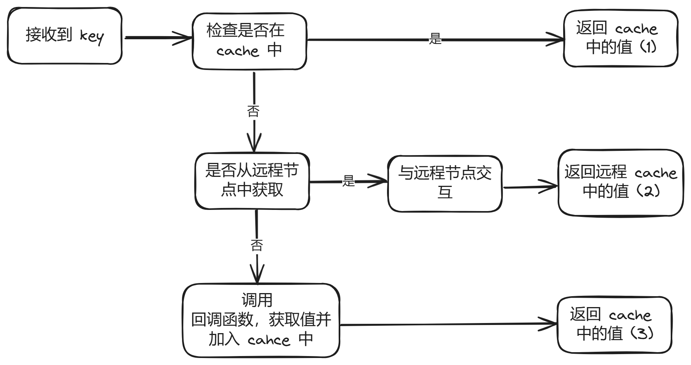

# GeeCache

一个分布式缓存系统的 Go 实现，参考[7天用Go从零实现分布式缓存GeeCache](https://geektutu.com/post/geecache.html)。

## 需求分析

首先，我们的目标是一个缓存系统，即 Cache，那么就需要考虑以下因素：

- 写入策略
- 查找策略
- 替换策略

而对于分布式系统，我们需要考虑这些因素：

- 不同系统之间的一致性
- 不同系统之间的通信

思考上面这些问题后，我们开始尝试实现它。

## LRU 缓存淘汰机制

常见的缓存淘汰算法有以下几种：

- FIFO：先进先淘汰。效果并不好，它优先照顾后面加入缓存的记录，某些情况下，如果某些较早的记录被频繁访问，就可能会频繁淘汰然后又写入。
- LFU：最少使用淘汰。记录每条记录的访问次数，对记录按访问次数排序，每次淘汰时淘汰访问次数最少的记录。实现消耗略高，因为需要频繁排序(当然，局部变更插入排序即可)。此外，它优先照顾整个历史中被频繁访问的记录，但是可能某些记录在一段时间后就不再使用，而又有可能因为访问次数过高而无法淘汰。
- LRU：最近最少使用淘汰。相对平衡上面两个算法，即照顾后加入缓存的记录，也考虑访问频繁的记录。

### LRU 实现

如上图所示，我们的 LRU 通过一个 字典(map) 和一个 双向链表(list)实现。

当某个记录被访问时，就把它从双向链表中移动到链表头，即最近使用。那么链表尾的记录就是最近最少使用的记录了。我们淘汰时，淘汰队尾即可。

实现接口如下：

- New：创建一个 LRUCache 实例
- Set: 写入 Cache
- Get: 在 Cache 中查询
- Remove: 在 Cache 中删除
- RemoveOldest: 淘汰最近最少使用的记录，无需手动调用

## 单机并发缓存

我们上面的 LRU 实现了一个独立的 cache，通过 LRU 算法淘汰记录。

现在我们考虑和用户有交互的情况：

- 多个用户同时读/写：并发控制，锁
- 用户获取数据的封装：从Test的体验就感受的到，单纯定义一个接口作为 Value 使用起来并不方便
- cache 不命中时，怎么获取数据：cpu cache 是向下层的内存请求调入数据块那样，参考这种思路，我们把不命中时获取数据的动作封装在回调函数中，用户应该实现相应的接口
- 拓展：为后面的分布式系统做一些兼容准备

1. ByteView

   封装 []byte 兼容任意格式的数据，来保存源数据，并实现 Len()，String()等方法

2. cache

   使用 sync.Mutex 封装的 lru cache，实现并发控制和延迟初始化。

3. Group

   主体结构，负责与用户的交互，控制 cache 值的存储和获取，支持Get 和 Set 操作。一个流程图如下所示：(使用 excalidraw 绘制，非常好用)。

4. Getter

   接口型函数，类似的写法在 HTTP.Handler 里也见过，感觉还是挺巧妙的，把这个工作交给用户负责。

## HTTP 服务

上面两步，我们实现了单机的 cache，通过锁控制并发。下面我们考虑实现分布式系统，即提到的两个问题：一致性和通信。本节解决通信问题。

考虑实现一个 HTTP.Handler，提供处理来自其他节点的对 <group>/<key> 的访问的响应，具体实现思路：

- 检查请求 URL，不满足合适的前缀，返回 NotFound
- 检查 URL，请求参数不合适，返回 BadRequest
- 然后从本机的 cache group 中查找相应的 value，未查找到，返回 InternalError(或许返回 NotFound更好?)
- 找到，则以字节形式返回 value

编写 HTTPTest，检验正确性。

## 一致性哈希

这一节我们实现一致性哈希，即 "资源缓存在哪个节点" 的问题。

除参考本文外，还参考了[一致性哈希算法原理详解](https://blog.csdn.net/a745233700/article/details/120814088)。

对于一项资源，如果有很多个分布的节点存放它，我们具体该存放到哪个节点呢？以及我们查找时，又从哪个节点查找该资源？这就是我们要解决的问题。

### 随机法

暴力的方法，即随机选一个节点存储，随机选一个节点仿问，如果未命中，再访问其他节点，效果很差。

### 普通哈希

把资源的 key 进行 哈希，然后对 节点数N 取模，放到对应的节点中。这样，访问时，依照相同的 哈希 并取模，就可以确定这项资源被存放在哪个节点。

但是有一个很大的问题，即节点数量发生变化。这会导致所有的 key 哈希的结果都发生改变，从而导致缓存全部失效，引起`缓存雪崩`。

> 缓存雪崩：缓存在同一时刻全部失效，造成瞬时DB请求量大、压力骤增，引起雪崩。常因为缓存服务器宕机，或缓存设置了相同的过期时间引起。

### 一致性哈希

一致性哈希算法同样是哈希，但是哈希后，不是对 节点数N 取模，而是对一个固定的很大的数，例如 2^32 取模。所有的哈希值可以围城一个环。

- 计算节点/机器(通常使用节点的名称、编号和 IP 地址)的哈希值，放置在环上。
- 计算 key 的哈希值，放置在环上，顺时针寻找到的第一个节点，就是应选取的节点/机器。

如下图所示，资源1,2 存放在节点 A 上，资源 3 存放在节点 B 上。

那么如果要 删除/新增节点呢？可以发现，这种方式下，最多有一个节点(即插入位置后面的第一个节点)会受到影响，整体的缓存受到的影响并不大，不会发生 缓存雪崩 问题。

#### 数据倾斜问题

如果节点在环上分布得不太均匀，或者节点数太少，可能会导致资源都被分配给 1 个节点，即数据倾斜问题。

为了解决这个问题，引入虚拟节点。即环上有很多虚拟节点，1个真实节点对应多个虚拟节点，这样增加节点数，并使得节点分布相对均匀，通过很小的代价(通过一个 map 记录虚拟节点-真实节点的映射关系即可)避免了数据倾斜问题。

代码实现思路：

- 使用锁，节点集合，虚拟节点和节点的映射 来描述
- 添加节点时，增加 n 个虚拟节点，并建立映射关系
- 删除节点时，删除 n 个虚拟节点，删除映射关系
- 对一个 key，在哈希环上查找应取得的节点位置时，做哈希，进行二分查找即可

